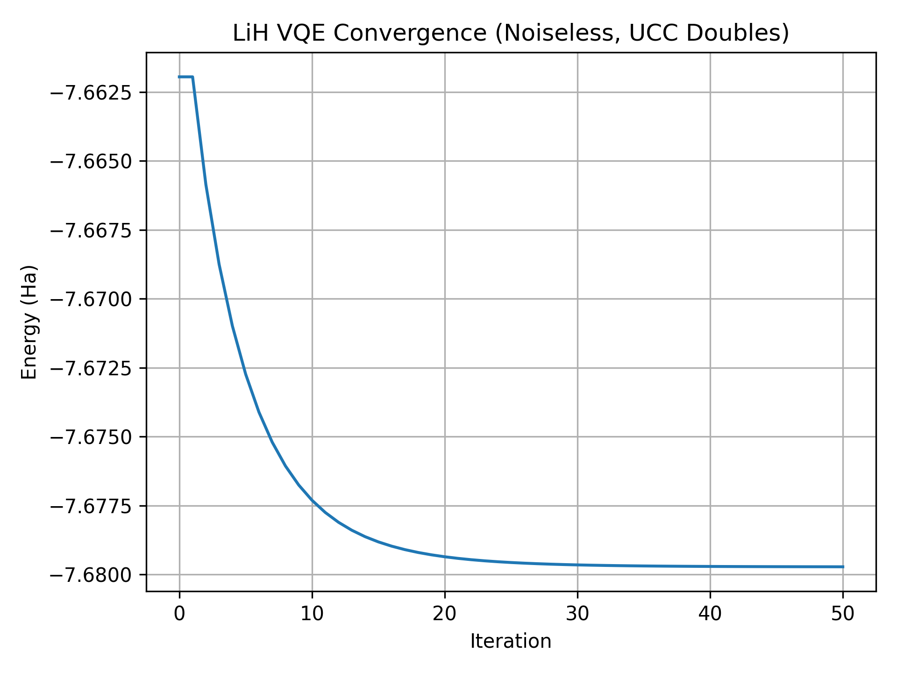

# Variational Quantum Eigensolver

This project implements a simulation of the **Variational Quantum Eigensolver (VQE)** algorithm for molecular systems such as **Dihydrogen (H₂)**, **Lithium Hydride (LiH)**, **Water (H₂O)**, and the **Trihydrogen Cation (H₃⁺)** using **PennyLane** and **Python**.  
We demonstrate **noiseless ground state energy calculations** and **eigenstate visualizations**, using different **ansatzes** approaches and **optimisers**.  
The optimum bond-length of LiH and bond-angle of water are determined, and excitation strategies for H₃⁺ are evaluated.

For detailed theoretical explanations, see [THEORY.md](THEORY.md).

To read our main findings and results, see [RESULTS.md](RESULTS.md).

---

## 📚 Table of Contents

- [Project Overview](#project-overview)
- [Technologies Used](#technologies-used)
- [Project Structure](#project-structure)
- [Usage](#usage)
- [Methodology Overview](#methodology-overview)
- [License & Author](#license--author)

---

## Project Overview

VQE is a hybrid quantum-classical algorithm used to solve quantum chemistry problems.
This project implements VQE for:

- **H₂ (Dihydrogen)**: Optimizer and ansatzes benchmarking
- **H₃⁺ (Trihydrogen Cation)**: Excitation, mapping comparisons and Subspace-Search VQE
- **LiH (Lithium Hydride)**: Ground-state energy across bond lengths  
- **H₂O (Water)**: Energy variation with bond angle

## Technologies Used

- **Python 3.10+**
- **NumPy**: Numerical computations
- **Matplotlib**: Data visualization
- **[PennyLane](https://pennylane.ai/)**: Quantum machine learning library
- **[PennyLane-qchem](https://pennylane.ai/qml/demos/tutorial_qchem.html)**: Quantum chemistry extension
- Scientific references: [arXiv papers](https://arxiv.org/search/?query=variational+quantum+eigensolver&searchtype=all)

## Project Structure

```
variational_quantum_eigensolver/
├── README.md                         # This file 
├── THEORY.md                         # Detailed theoretical background
├── RESULTS.md                        # Results and analysis
├── LICENSE                           # MIT license
├── requirements.txt                  # Dependencies
├── .gitignore                        # Git ignore rules (untracked files/artifacts)
└── notebooks/                        # Jupyter notebooks written in Python
    ├── images/                       # Directory of generated visualization plots
    ├── vqe_utils.py                  # Utilities file
    ├── H2_Noiseless.ipynb            # Noiseless H₂ VQE implementation
    ├── H2_Ansatz_Comparison.ipynb    # Comparing ansatzes for H₂
    ├── H3+_Noiseless.ipynb           # Single vs. Double vs. UCCSD for H₃⁺
    ├── H3+_Mapping_Comparison.ipynb  # Mapping comparison for H₃⁺
    ├── H3+_SSVQE.ipynb               # SSVQE for H₃⁺
    ├── LiH_Noiseless.ipynb           # Noiseless LiH VQE implementation
    ├── LiH_Bond_Length.ipynb         # Optimum bond-length of LiH
    ├── H2O_Noiseless.ipynb           # Noiseless H₂O VQE implementation
    └── H2O_Bond_Angle.ipynb          # Optimum bond-angle of H₂O
```

## Usage

### Quick Start

1. Clone the repository:

```bash
git clone https://github.com/SidRichardsQuantum/variational_quantum_eigensolver.git
cd variational_quantum_eigensolver
```

2. Install dependencies:

```bash
pip install -r requirements.txt
```

3. Run the VQE simulations:

```bash
# Lithium Hydride (LiH)
jupyter notebook notebooks/LiH_Noiseless.ipynb

# Runs a noiseless VQE with a double–excitation UCC ansatz and the gradient descent optimizer
# Outputs convergence plots and the final ground state amplitudes
```

### Results Preview

Running `notebooks/LiH_Noiseless.ipynb` produces:

- **Convergence of VQE energy** (noiseless, LiH, double excitation ansatz)
- **Final ground state energy** close to the expected Hartree–Fock reference
- **Ground state amplitudes** plotted as a bar chart



## Methodology Overview

1. Molecular Setup: generated using PennyLane's `qchem` module

2. Quantum State Preparation:

- Hartree-Fock reference state as initial guess
- Jordan-Wigner transformation maps fermions to qubits

3. Ansatzes Construction:

- Single and/or double excitation circuits
- Ansatzes comparison for H₂
- Full excitation comparison analysis for H₃⁺

4. VQE Optimization:

- Classical optimisers such as Adam, Gradient Descent, Nesterov, SPSA, etc...
- Energy tracked at each iteration
- Different optimisers compared for H₂

5. Analysis & Visualization

- Energy convergence plots
- Quantum state amplitude distributions
- Quantum circuit diagrams
- Bond-lengths and angles against ground state energies

---

📘 Author: Sid Richards (SidRichardsQuantum)

 LinkedIn: https://www.linkedin.com/in/sid-richards-21374b30b/

This project is licensed under the MIT License - see the [LICENSE](LICENSE) file for details.
