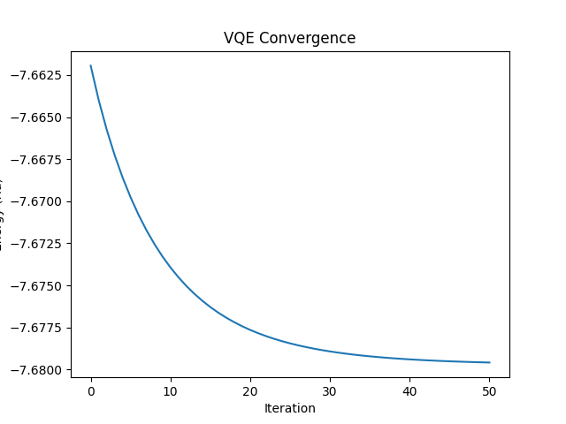
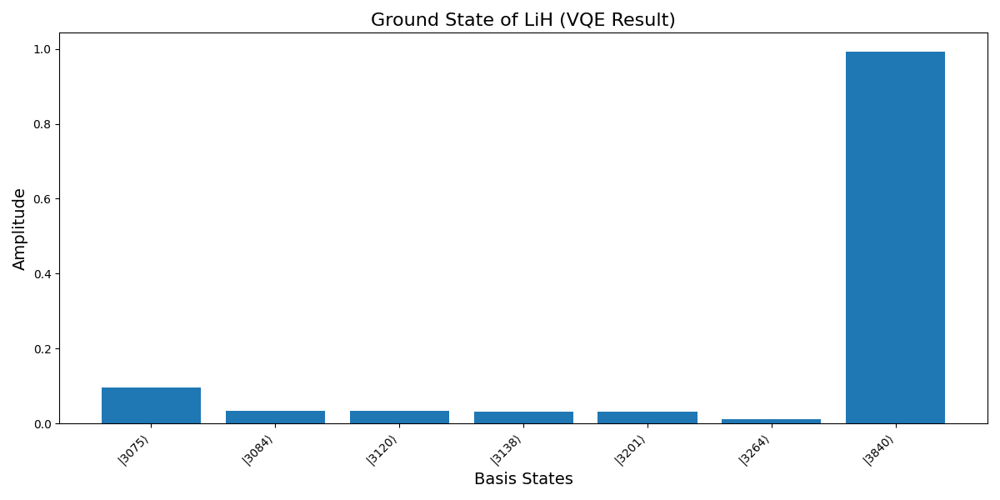
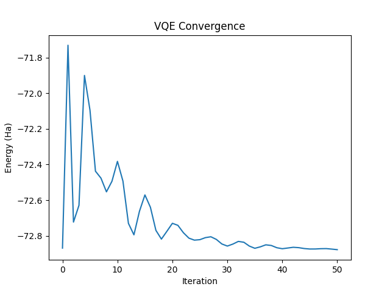
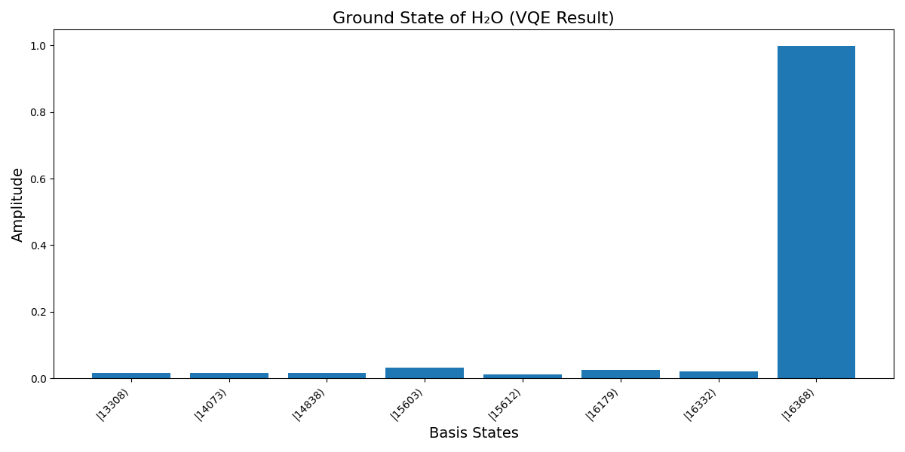
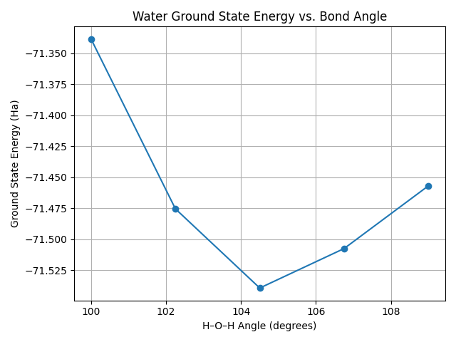

# Results

The project generates comprehensive visualizations for molecular systems.
Both visualizations demonstrate the dominance of the Hartree-Fock reference state with correlation corrections from excitations.
Basis state indices are converted from binary to decimal for shorter/clearer axis-labeling.

## LiH

### Set Up

- **Bond Length**: $1.6 Å$
- **Hartree-Fock Energy**: $-7.66194677 Ha$
- **Convergence**: $50$ iterations

### Visualization

```GradientDescentOptimizer``` with step-size $0.1$ successfully converges at ground state energy $-7.67957954 Ha$:



The calculated wavefunction for the ground state of LiH is:

```
|ψ⟩ = 0.9930|111100000000⟩ - 0.0969|110000000011⟩ 
    - 0.0334|110000001100⟩ - 0.0334|110000110000⟩ 
    - 0.0317|110001000010⟩ + 0.0317|110010000001⟩ 
    - 0.0123|110011000000⟩
```

The Hartree-Fock state $|111100000000⟩$ is the most dominant.



## H₂O

### Set Up

- **Bond Lengths**: $0.910922 Å$
- **Molecular Geometry**: Bent structure ($104.5\textdegree$ bond angle)
- **Hartree-Fock Energy**: $-72.86837737 Ha$
- **Convergence**: $50$ iterations with Adam optimizer

### Visualization

```AdamOptimizer```  with step-size $0.1$ successfully converges at ground state energy $-72.87712785 Ha$:



The calculated wavefunction for the ground state of water is:

```
|ψ⟩ = 0.9979|11111111110000⟩ - 0.0323|11110011110011⟩
    - 0.0244|11111100110011⟩ - 0.0211|11111111001100⟩
    + 0.0171|11100111110110⟩ - 0.0160|11001111111100⟩
    + 0.0156|11011011111001⟩ - 0.0105|11110011111100⟩
```

The Hartree-Fock state $|11111111110000⟩$ is the most dominant.



## Optimal H₂O Angle

The Adam optimizer was used to find the angle between the two hydrogens in water.
$10$ maximum iterations and a stepsize of $0.2$ were used, over $5$ bond-angles in the range $[100, 109]$.
```notebooks/Water_Angle_VQE.png``` outputs:



```
Minimum energy: -71.539353 Ha
Optimal angle: 104.50°
```

These values are very close to the true ground state energy ($\approx -75 Ha$) and bond-angle ($\approx 104.5\textdegree$) of water.
[Chemical bonding of water](https://en.wikipedia.org/wiki/Chemical_bonding_of_water)
[Ground-state energy estimation of the water molecule on a trapped ion quantum computer](https://arxiv.org/abs/1902.10171)

---

📘 Author: Sid Richards (SidRichardsQuantum)

 LinkedIn: https://www.linkedin.com/in/sid-richards-21374b30b/

This project is licensed under the MIT License - see the [LICENSE](LICENSE) file for details.
