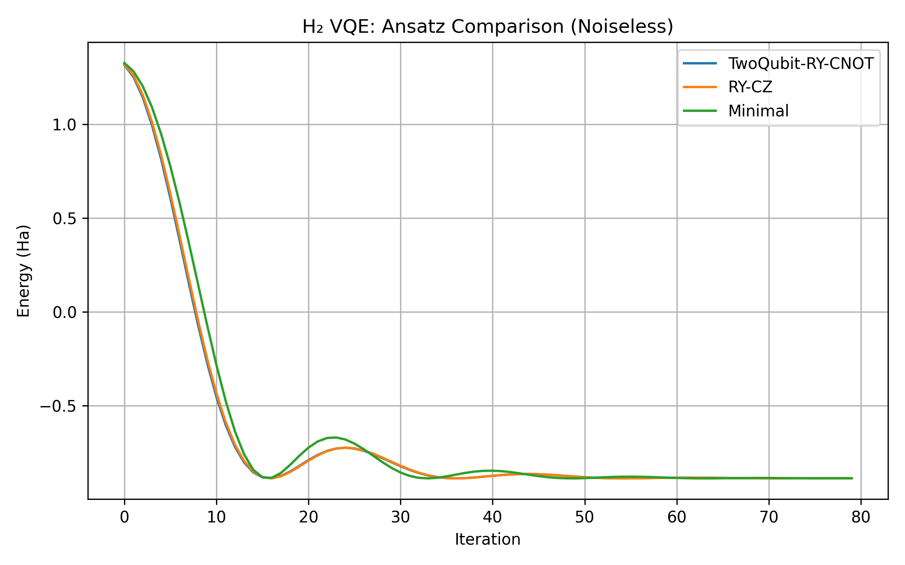
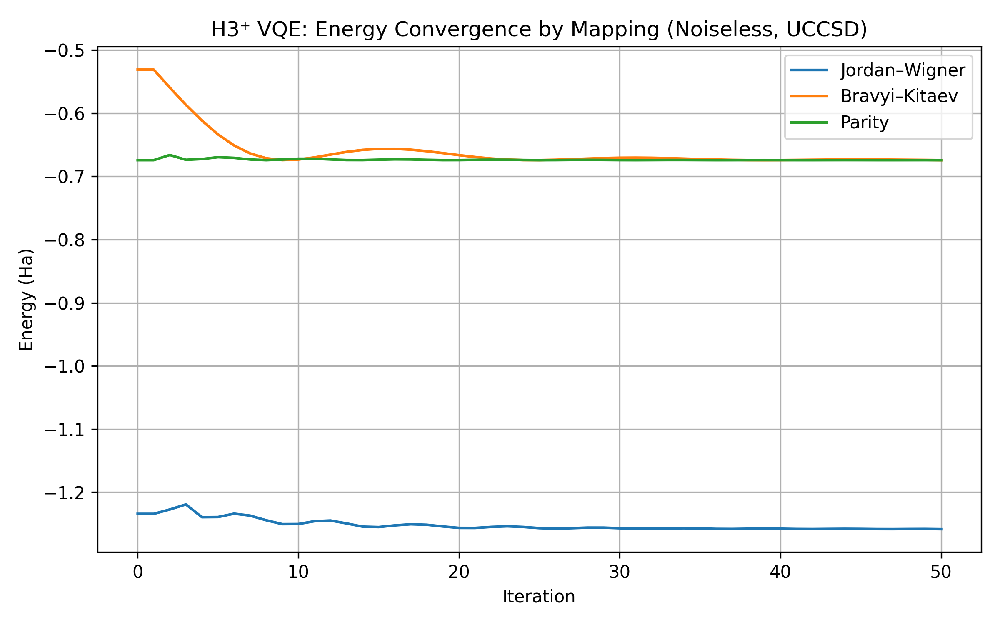

# Results

The project generates comprehensive visualizations for molecular systems.
Both visualizations demonstrate the dominance of the Hartree-Fock reference state with correlation corrections from excitations.
Basis state indices are converted from binary to decimal for shorter/clearer axis-labeling.

---

## 📚 Table of Contents
- [H₂ Optimiser Comparison](#h₂-optimiser-comparison)
- [H₂ Ansatze Comparison](#h₂-ansatze-comparison)
- [H₃⁺ Excitation Comparison](#h₃⁺-excitation-comparison)
- [H₃⁺ Mapping Comparison](#h₃⁺-mapping-comparison)
- [H₃⁺ SSVQE](#h₃⁺-ssvqe)
- [LiH](#lih)
- [Optimal LiH Length](#optimal-lih-length)
- [H₂O](#h₂o)
- [Optimal H₂O Angle](#optimal-h₂o-angle)

---

## H₂ Optimiser Comparison

### Set Up

- **Bond Length**: $0.7414 Å$
- **Hartree-Fock Energy**: $-0.88842304 Ha$
- **Convergence**: $50$ iterations

### Visualization

Every optimiser with step size $0.2$, successfully converts at ground state energies:

```
Adam:
Final ground state energy = -0.89801978 Ha

GradientDescent:
Final ground state energy = -0.89805304 Ha

Nesterov:
Final ground state energy = -0.89805302 Ha

Adagrad:
Final ground state energy = -0.89805304 Ha

Momentum:
Final ground state energy = -0.89801009 Ha

SPSA:
Final ground state energy = -0.89566722 Ha
```


The best optimizer for this dihydrogen example is the Gradient Descent.
Using this, the ground state is found:


```
Ground state of H₂:
|ψ⟩ = -0.0585|0011> + 0.9983|1100>
```


## H₂ Ansatze Comparison

### Set Up

- **Bond Length**: $0.7414 Å$
- **Optimizer**: `AdamOptimizer` with step size $0.2$
- **Iterations**: $40$
- **Ansatzes Compared**: `UCCSD`, `RY-CZ`, `Minimal`

### Visualization

The following ansatzes were tested in a noiseless simulation:

- **UCCSD**: A chemically motivated circuit including single and double excitations.
- **$R_Y-C_Z$**: A hardware-efficient structure using rotation and $C_Z$ entanglement layers.
- **Minimal**: A single-parameter ansatzes tailored for H₂.

All three ansatzes successfully converged to near ground-state energies within $40$ iterations:

```
UCCSD:
Final energy = -0.87975978 Ha

RY-CZ:
Final energy = -0.87936449 Ha

Minimal:
Final energy = -0.84822983 Ha
```



Although all ansatzes reach similar energy minima, UCCSD and RY-CZ converge slightly faster while **Minimal** shows mild oscillations mid-convergence.

## H₃⁺ Excitation Comparison

### Set Up

- **Molecular Geometry**: Equilateral triangle ($1.0 Å$ side length)
- **Charge**: $+1$
- **Electrons**: 2
- **Optimizer**: `Adam` with step size $0.2$
- **Iterations**: $50$ per excitation type
- **Excitations Compared**: Single, Double, Both (UCCSD)

### Visualization

The simulation compares three ansatze types in a noiseless VQE run. Final ground state energies:

```
Single excitations only:
Final energy = -1.24811821 Ha

Double excitations only:
Final energy = -1.25027788 Ha

Single + Double (UCCSD):
Final energy = -1.25028914 Ha
```


The best convergence and lowest energy are achieved when both single and double excitations are used, consistent with the expected benefits of the full UCCSD ansatze.

The wavefunctions reveal a dominant contribution from the Hartree-Fock reference state, with notable amplitudes in correlated excited states. Example from UCCSD:

```
|ψ⟩ = 0.9813|110000⟩ - 0.0806|100010⟩ - 0.0773|100100⟩ + 0.0667|010001⟩
    - 0.0577|010100⟩ + 0.0481|110011⟩ + 0.0332|110100⟩ + 0.0226|100001⟩
```

This decomposition showcases the entanglement and correlation introduced by higher-order excitations. The Hartree-Fock state $|110000⟩$ is again dominant, but its amplitude is reduced relative to smaller molecules due to increased multi-reference character.

A quantum circuit diagram for the UCCSD ansatzes is below:


## H₃⁺ Mapping Comparison

### Set Up

- **Molecular Geometry**: Slightly distorted triangular geometry
- **Coordinates**:  
  - H₁ = (0.000000,  1.000000,  0.000000)  
  - H₂ = (–0.866025, –0.500000,  0.000000)  
  - H₃ = (0.800000, –0.300000,  0.000000)
- **Charge**: $+1$
- **Electrons**: 2
- **Ansatze**: UCCSD (Singles + Doubles)
- **Optimizer**: `AdamOptimizer` with step size $0.2$
- **Iterations**: $50$
- **Mappings Compared**: `jordan_wigner`, `bravyi_kitaev`, `parity`

### Visualization

The simulation compares three fermion-to-qubit encodings using the same ansatze and optimizer.
Final ground state energies:

```
jordan_wigner: -1.25860509 Ha
bravyi_kitaev: -1.31943557 Ha
parity:        -1.20493135 Ha
```



The **Bravyi-Kitaev** mapping converges to the lowest energy among the three, though all mappings reach similar accuracy after $50$ iterations.

Each encoding transforms the fermionic Hamiltonian differently, influencing qubit operator structure and gradient behavior.  
This comparison highlights how even under identical ansatzes, fermion-to-qubit mapping can affect convergence rate and minima.

## H₃⁺ SSVQE

### Set Up

- **Molecular Geometry**: Equilateral triangle ($0.87 Å$ side length)
- **Charge**: $+1$
- **Electrons**: $2$
- **Basis**: STO-3G
- **Ansatz**: UCC-style singles + doubles (from `qchem.excitations`)
- **Optimizer**: Adam with step size $0.4$
- **Iterations**: $75$
- **Penalty Weight**: $10 * | ⟨ \psi_0 | \psi_1 ⟩ |^2$

### Visualization

SSVQE was used to variationally optimize the ground and first excited states simultaneously, enforcing orthogonality between the states.  
The final energies obtained were:

```
Ground state (E₀) = -1.25980889 Ha
First excited state (E₁) = -0.55811374 Ha
Excitation gap ΔE = 0.70169515 Ha
```


The **ground state** is dominated by the Hartree–Fock configuration $|110000⟩$,  
while the **first excited state** shifts amplitude toward $|100100⟩$ and other configurations, showing clear state separation:


The orthogonality penalty successfully suppressed overlap between the states, producing distinct quantum states with a meaningful excitation energy gap.

## LiH

### Set Up

- **Bond Length**: $1.6 Å$
- **Hartree-Fock Energy**: $-7.66194677 Ha$
- **Convergence**: $50$ iterations

### Visualization

`GradientDescentOptimizer` with step-size $0.1$ successfully converges at ground state energy $-7.67957954 Ha$:


The calculated wavefunction for the ground state of LiH is:

```
|ψ⟩ = 0.9930|111100000000⟩ - 0.0969|110000000011⟩ 
    - 0.0334|110000001100⟩ - 0.0334|110000110000⟩ 
    - 0.0317|110001000010⟩ + 0.0317|110010000001⟩ 
    - 0.0123|110011000000⟩
```

The Hartree-Fock state $|111100000000⟩$ is the most dominant.


## Optimal LiH Length

The Gradient Descent Optimizer was used to scan over a range of bond-lengths between the Li and H atoms.
$25$ maximum iterations and a stepsize of $0.8$ were used, over $10$ bond-lengths in the range $[1.1, 2.1] Å$.
Plot output from `LiH_Bond_Length.ipynb`:


```
Optimal bond length: 1.66 Å
Minimum ground state energy: -5.59345560 Ha
```

## H₂O

### Set Up

- **Bond Lengths**: $0.910922 Å$
- **Molecular Geometry**: Bent structure ($104.5°$ bond angle)
- **Hartree-Fock Energy**: $-72.86837737 Ha$
- **Convergence**: $50$ iterations with Adam optimizer

### Visualization

`AdamOptimizer`  with step-size $0.1$ successfully converges at ground state energy $-72.87712785 Ha$:


The calculated wavefunction for the ground state of water is:

```
|ψ⟩ = 0.9979|11111111110000⟩ - 0.0323|11110011110011⟩
    - 0.0244|11111100110011⟩ - 0.0211|11111111001100⟩
    + 0.0171|11100111110110⟩ - 0.0160|11001111111100⟩
    + 0.0156|11011011111001⟩ - 0.0105|11110011111100⟩
```

The Hartree-Fock state $|11111111110000⟩$ is the most dominant.


## Optimal H₂O Angle

The Adam optimizer was used to find the angle between the two hydrogens in water.
$10$ maximum iterations and a stepsize of $0.2$ were used, over $5$ bond-angles in the range $[100, 109]°$.
Plot output from `H2O_Bond_Angle.ipynb`:


```
Minimum energy: -71.539353 Ha
Optimal angle: 104.50°
```

These values are very close to the true ground state energy ($\approx -75 Ha$) and bond-angle ($\approx 104.5°$) of water.
[Chemical bonding of water](https://en.wikipedia.org/wiki/Chemical_bonding_of_water)
[Ground-state energy estimation of the water molecule on a trapped ion quantum computer](https://arxiv.org/abs/1902.10171)

---

📘 Author: Sid Richards (SidRichardsQuantum)

 LinkedIn: https://www.linkedin.com/in/sid-richards-21374b30b/

This project is licensed under the MIT License - see the [LICENSE](LICENSE) file for details.
