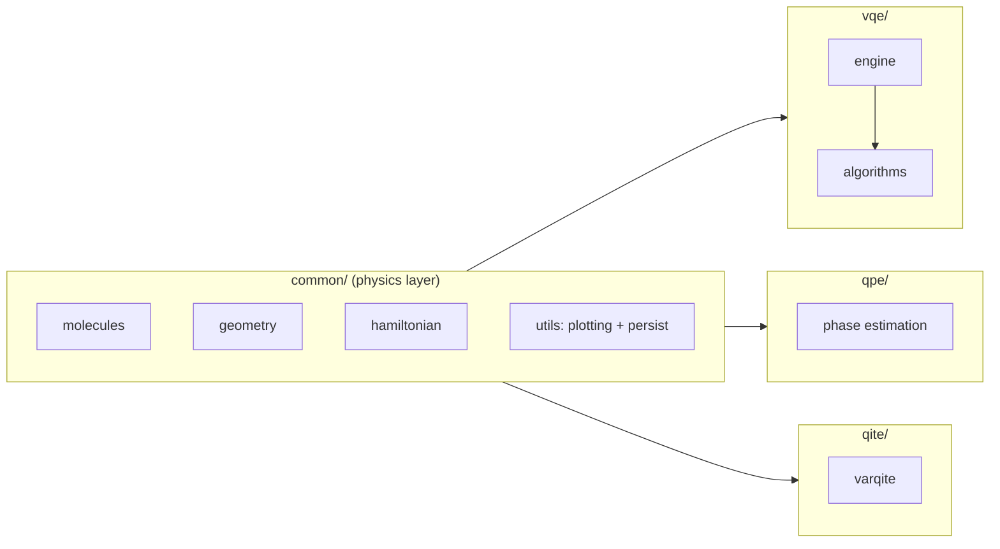
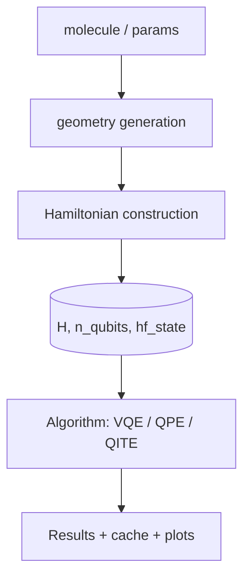
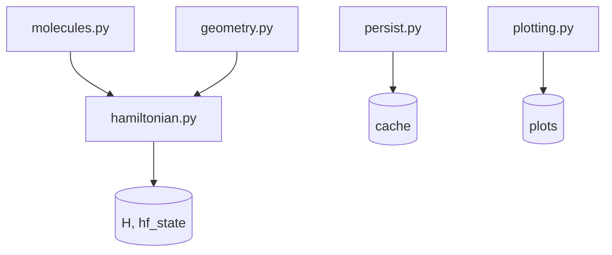
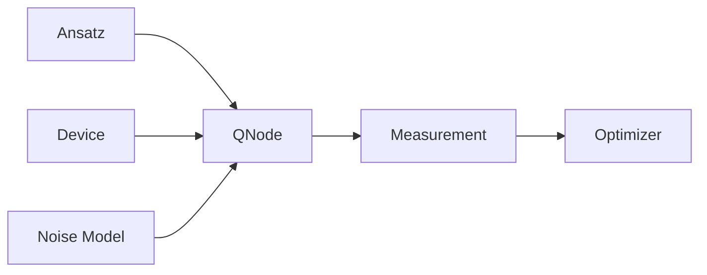
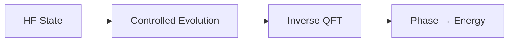
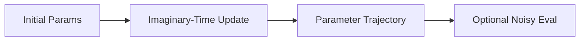
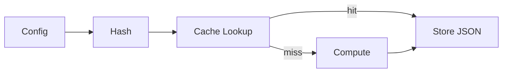

# Architecture Overview

## Scope

Defines the system architecture across:

- module boundaries and responsibilities
- data flow across algorithm stacks
- shared infrastructure (Hamiltonians, devices, caching)
- design invariants

---

## High-Level Structure

The repository is organized into four primary packages:

```

common/   → shared physics + infrastructure
vqe/      → variational algorithms + excited states
qpe/      → phase estimation
qite/     → imaginary-time evolution

```

---

### System Map



---

## Core Invariant

> **All algorithms operate on the same Hamiltonian and reference state.**

Implications:

- cross-method comparisons are physically valid
- no duplicated system construction logic
- reproducible results across stacks

---

## System Flow

### End-to-End



---

### Interface Contract

All stacks consume:

```python
H, n_qubits, hf_state = build_hamiltonian(...)
```

This is the **only entrypoint into the physics layer**.

---

## The `common` Layer

### Role

Single source of truth for:

- molecular definitions
- geometry generation
- Hamiltonian construction
- shared utilities

---

### Internal Structure



---

## Execution Model (VQE Engine)

### Role

Central execution layer for all variational methods.

```
vqe/engine.py
```

---

### Execution Pipeline



---

## Algorithm Layers

### VQE Stack

```
vqe/
├── core.py
├── adapt.py
├── lr_vqe.py
├── eom_vqe.py
├── qse.py
├── eom_qse.py
├── ssvqe.py
├── vqd.py
```

Properties:

- thin wrappers over engine + common
- define objective / eigenproblem only
- return structured outputs

---

### QPE Stack



Characteristics:

- Trotterized evolution
- no variational loop
- shares Hamiltonian interface

---

### QITE Stack



Design:

1. noiseless parameter evolution
2. post-hoc noisy evaluation

---

## Devices and Differentiation

### Device selection

| Mode      | Device          |
| --------- | --------------- |
| Noiseless | `default.qubit` |
| Noisy     | `default.mixed` |

---

### Differentiation

| Mode      | Method          |
| --------- | --------------- |
| Noiseless | parameter-shift |
| Noisy     | finite-diff     |

Handled automatically in the execution layer.

---

## Noise Model

Applied at the circuit level:

```
ansatz → noise → measurement
```

- pluggable `noise_model(wires)`
- consistent across VQE-family methods

---

## Caching and Reproducibility

### Model



---

### Guarantees

- identical inputs → identical cache keys
- stable parameter rounding
- reproducible outputs

---

## Interfaces

### CLI

```
vqe  --molecule H2
qpe  --molecule H2
qite run --molecule H2
```

### Python

```python
from vqe.core import run_vqe
res = run_vqe(...)
```

Both map to the same execution paths.

---

## Design Patterns

### 1. Single source of truth

- all physics in `common`
- zero duplication

---

### 2. Thin algorithm layers

- algorithms define *what*
- engine defines *how*

---

### 3. Layer separation

| Layer       | Responsibility |
| ----------- | -------------- |
| Physics     | `common`       |
| Execution   | `vqe.engine`   |
| Algorithms  | `vqe/*.py`     |
| Persistence | `common`       |

---

### 4. Deterministic system

- stable hashing
- reproducible outputs

---

### 5. Backward compatibility

- legacy interfaces preserved
- backend fallbacks

---

## Extensibility

### Add ansatz

- implement in `vqe/ansatz.py`
- conform to engine interface

---

### Add optimizer

- register in `vqe/optimizer.py`

---

### Add algorithm

- new module in `vqe/`
- reuse:

  - `build_hamiltonian`
  - engine QNodes

---

## Summary

The system is built around:

- a **shared physical layer** (`common`)
- a **central execution model** (engine)
- multiple **algorithm stacks** (VQE, QPE, QITE)

---

## Key Takeaway

> The architecture separates **physics**, **execution**, and **algorithms**, enabling independent evolution while preserving cross-method consistency.
