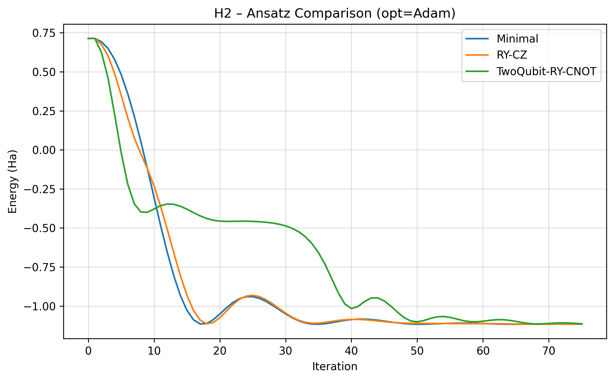
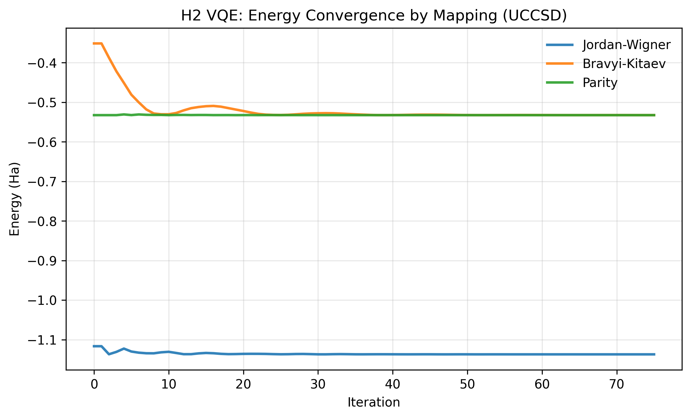
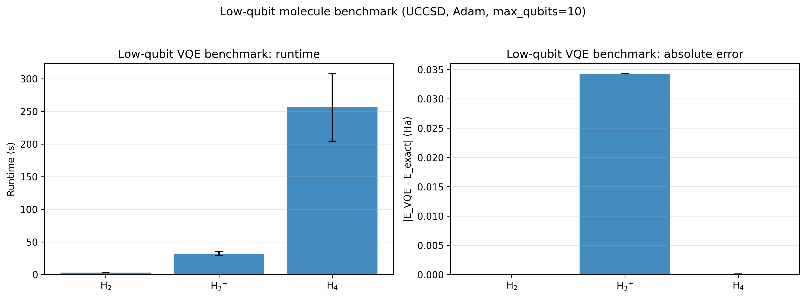

# Benchmark Results

This page is a curated index for result-bearing benchmark notebooks. It points
to the notebooks that currently contain decision-ready tables, figures, or
diagnostics. Raw files under `results/` and `images/` are ignored generated
artifacts and should not be treated as published benchmark data.

## Published Result Surfaces

| Question | Notebook | Primary outputs |
| --- | --- | --- |
| Which method should I use on H2? | `comparisons/H2/Cross_Method_Comparison.ipynb` | Cross-method energy, error, runtime, and cache diagnostics. |
| How reproducible are H2 runs? | `comparisons/H2/Reproducibility_Benchmark.ipynb` | Seed spread, noisy/noiseless variation, and cache timing. |
| Which method should I use on LiH? | `comparisons/LiH/Cross_Method_Comparison.ipynb` | Active-space LiH VQE, VarQITE, and QPE comparison. |
| How reproducible are LiH runs? | `comparisons/LiH/Reproducibility_Benchmark.ipynb` | Per-seed spread, noisy/noiseless variation, and cache timing. |
| Are QPE defaults adequate for H2? | `qpe/H2/Calibration_Decision_Map.ipynb` | Ranked QPE configurations, branch diagnostics, and default-adequacy checks. |
| How should QPE be calibrated? | `qpe/H2/Calibration_Sweep.ipynb` | Ancilla/evolution-time/shot sweep outputs. |
| What are reasonable package defaults? | `defaults/VQE_Default_Calibration.ipynb` | VQE default calibration table. |
| What are reasonable VarQITE defaults? | `defaults/VarQITE_Default_Calibration.ipynb` | VarQITE default calibration table. |
| What are reasonable QPE defaults? | `defaults/QPE_Default_Calibration.ipynb` | QPE default calibration table. |
| Which low-qubit molecules are ready? | `comparisons/multi_molecule/Low_Qubit_VQE_Benchmark.ipynb` | Low-qubit VQE comparison plot and table. |
| How does the registry scale? | `comparisons/multi_molecule/Scaling_Benchmark.ipynb` | Runtime, qubit-count, error, and proxy-size tables. |
| Which atom/cation pairs support ionization studies? | `comparisons/multi_molecule/Atomic_Ionization_Energy_Benchmark.ipynb` | Ionization energy panel in Hartree and eV. |
| How do model Hamiltonians behave? | `non_molecule/TFIM_Cross_Method_Benchmark.ipynb` | TFIM exact/VQE/VarQITE/QPE comparison. |
| How do XXZ chains behave? | `non_molecule/Heisenberg_Chain_Benchmark.ipynb` | Heisenberg-chain anisotropy sweep. |
| How do SSH chains behave? | `non_molecule/SSH_Chain_Benchmark.ipynb` | SSH dimerization sweep. |
| How does VarQRTE compare with exact evolution? | `qite/H2/Exact_QRTE_Benchmark.ipynb` | Real-time evolution comparison against exact dynamics. |
| Which VQE ansatz works for H2? | `vqe/H2/Ansatz_Comparison.ipynb` | Ansatz convergence comparison. |
| Which mapping works for H2? | `vqe/H2/Mapping_Comparison.ipynb` | Mapping comparison plot and table. |
| How robust is VQE under noise? | `vqe/H2/Noise_Robustness_Benchmark.ipynb` | Cross-channel noise sensitivity ranking. |
| How do excited-state solvers compare? | `vqe/H2/SSVQE_Comparisons.ipynb` and `vqe/H2/VQD_Comparisons.ipynb` | Excited-state variational solver comparisons. |
| How do H3+ ansatzes compare? | `vqe/H3plus/Ansatz_Comparison_Noiseless.ipynb` and `vqe/H3plus/Ansatz_Comparison_Noisy.ipynb` | Noiseless/noisy H3+ ansatz comparison. |

## Local Generated Figures

The current cleaned local image set contains only figures referenced by notebook
output text:

| Figure | Produced by |
| --- | --- |
| `images/vqe/H2/ansatz_conv_Adam_s0.png` | `vqe/H2/Ansatz_Comparison.ipynb` |
| `images/vqe/H2/mapping_comparison_UCCSD_Adam.png` | `vqe/H2/Mapping_Comparison.ipynb` |
| `images/vqe/multi_molecule/low_qubit_benchmark_UCCSD_Adam_jordan_wigner_max10q.png` | `comparisons/multi_molecule/Low_Qubit_VQE_Benchmark.ipynb` |

These files are ignored by git. If a result figure should appear in the
published Sphinx site, promote a curated copy into a tracked docs asset path
rather than relying on `images/`.

## Recommended Next Step

Run the exporter after rerunning the important benchmark notebooks:

```bash
python scripts/export_benchmark_artifacts.py
```

The exporter copies selected generated figures and extracts selected saved
notebook tables into `notebooks/benchmarks/_artifacts/`, then rewrites the
generated section below.

<!-- benchmark-artifacts:start -->

## Curated Figures

### H2 Ansatz Comparison

Source notebook: `vqe/H2/Ansatz_Comparison.ipynb`



### H2 Mapping Comparison

Source notebook: `vqe/H2/Mapping_Comparison.ipynb`



### Low-Qubit VQE Benchmark

Source notebook: `comparisons/multi_molecule/Low_Qubit_VQE_Benchmark.ipynb`



## Curated Tables

### H2 Cross-Method Runtime

Source notebook: `comparisons/H2/Cross_Method_Comparison.ipynb`

CSV artifact: `_artifacts/tables/h2_cross_method_runtime.csv`

| method | elapsed_s |
| --- | --- |
| QPE | 0.035338 |
| VarQITE | 0.035894 |
| VQE | 0.069197 |

### LiH Problem Summary

Source notebook: `comparisons/LiH/Cross_Method_Comparison.ipynb`

CSV artifact: `_artifacts/tables/lih_problem_summary.csv`

| setting | value |
| --- | --- |
| molecule | LiH |
| mapping | jordan_wigner |
| active_electrons | 2 |
| active_orbitals | 2 |
| num_qubits | 4 |
| hamiltonian_terms | 27 |
| exact_ground_energy | -7.862129 |

### LiH Cross-Method Results

Source notebook: `comparisons/LiH/Cross_Method_Comparison.ipynb`

CSV artifact: `_artifacts/tables/lih_cross_method_results.csv`

| method | energy | exact_ground | abs_error | runtime_s | compute_runtime_s | cache_hit | num_qubits |
| --- | --- | --- | --- | --- | --- | --- | --- |
| VarQITE | -7.862129 | -7.862129 | 2.200000e-07 | 1.162672 |  | True | 4 |
| VQE | -7.862128 | -7.862129 | 6.200000e-07 | 1.195395 | 5.518632 | True | 4 |
| QPE | -6.675884 | -7.862129 | 1.186244e+00 | 1.234748 |  | True | 4 |

### QPE H2 Best Configurations

Source notebook: `qpe/H2/Calibration_Decision_Map.ipynb`

CSV artifact: `_artifacts/tables/qpe_h2_best_configurations.csv`

| ancillas | t | trotter_steps | shots | seed | energy | abs_error | best_bitstring | best_probability | oracle_any_abs_error | branch_selection_failure | dominant_bin_failure | resolution_or_alias_failure | cache_hit |
| --- | --- | --- | --- | --- | --- | --- | --- | --- | --- | --- | --- | --- | --- |
| 2 | 4.0 | 1 |  | 0 | -1.178097 | 0.040827 | 11 | 0.513338 | 0.040827 | False | False | False | True |
| 2 | 4.0 | 1 | 500.0 | 1 | -1.178097 | 0.040827 | 11 | 0.542000 | 0.040827 | False | False | False | True |
| 2 | 4.0 | 1 | 500.0 | 0 | -1.178097 | 0.040827 | 11 | 0.498000 | 0.040827 | False | False | False | True |
| 2 | 4.0 | 1 | 500.0 | 2 | -1.178097 | 0.040827 | 11 | 0.494000 | 0.040827 | False | False | False | True |
| 2 | 4.0 | 1 | 1000.0 | 0 | -1.178097 | 0.040827 | 11 | 0.520000 | 0.040827 | False | False | False | True |
| 2 | 4.0 | 1 | 1000.0 | 2 | -1.178097 | 0.040827 | 11 | 0.516000 | 0.040827 | False | False | False | True |
| 2 | 4.0 | 1 | 2000.0 | 0 | -1.178097 | 0.040827 | 11 | 0.521500 | 0.040827 | False | False | False | True |
| 2 | 4.0 | 1 | 1000.0 | 1 | -1.178097 | 0.040827 | 11 | 0.518000 | 0.040827 | False | False | False | True |
| 2 | 4.0 | 1 | 2000.0 | 2 | -1.178097 | 0.040827 | 11 | 0.505000 | 0.040827 | False | False | False | True |
| 2 | 4.0 | 1 | 2000.0 | 1 | -1.178097 | 0.040827 | 11 | 0.512000 | 0.040827 | False | False | False | True |

### QPE H2 Ranked Summary

Source notebook: `qpe/H2/Calibration_Decision_Map.ipynb`

CSV artifact: `_artifacts/tables/qpe_h2_ranked_summary.csv`

| ancillas | t | trotter_steps | shots_label | mean_abs_error | std_abs_error | max_abs_error | mean_oracle_abs_error | mean_bin_width_energy_ha | branch_failure_rate | dominant_bin_failure_rate | resolution_or_alias_failure_rate | mean_compute_runtime_s | score |
| --- | --- | --- | --- | --- | --- | --- | --- | --- | --- | --- | --- | --- | --- |
| 2 | 4.0 | 1 | analytic | 0.040827 | 0.0 | 0.040827 | 0.040827 | 0.392699 | 0.0 | 0.0 | 0.0 | 0.076394 | 0.040865 |
| 2 | 4.0 | 1 | 500 | 0.040827 | 0.0 | 0.040827 | 0.040827 | 0.392699 | 0.0 | 0.0 | 0.0 | 0.084816 | 0.040869 |
| 2 | 4.0 | 1 | 1000 | 0.040827 | 0.0 | 0.040827 | 0.040827 | 0.392699 | 0.0 | 0.0 | 0.0 | 0.092987 | 0.040874 |
| 2 | 4.0 | 1 | 2000 | 0.040827 | 0.0 | 0.040827 | 0.040827 | 0.392699 | 0.0 | 0.0 | 0.0 | 0.101829 | 0.040878 |
| 2 | 4.0 | 2 | analytic | 0.040827 | 0.0 | 0.040827 | 0.040827 | 0.392699 | 0.0 | 0.0 | 0.0 | 0.106913 | 0.040881 |
| 2 | 4.0 | 2 | 500 | 0.040827 | 0.0 | 0.040827 | 0.040827 | 0.392699 | 0.0 | 0.0 | 0.0 | 0.110669 | 0.040882 |
| 3 | 4.0 | 1 | analytic | 0.040827 | 0.0 | 0.040827 | 0.040827 | 0.196350 | 0.0 | 0.0 | 0.0 | 0.112833 | 0.040883 |
| 3 | 4.0 | 1 | 500 | 0.040827 | 0.0 | 0.040827 | 0.040827 | 0.196350 | 0.0 | 0.0 | 0.0 | 0.120086 | 0.040887 |
| 2 | 4.0 | 2 | 1000 | 0.040827 | 0.0 | 0.040827 | 0.040827 | 0.392699 | 0.0 | 0.0 | 0.0 | 0.126221 | 0.040890 |
| 2 | 4.0 | 2 | 2000 | 0.040827 | 0.0 | 0.040827 | 0.040827 | 0.392699 | 0.0 | 0.0 | 0.0 | 0.126231 | 0.040890 |

### Low-Qubit VQE Summary

Source notebook: `comparisons/multi_molecule/Low_Qubit_VQE_Benchmark.ipynb`

CSV artifact: `_artifacts/tables/low_qubit_vqe_summary.csv`

| molecule | num_qubits | hamiltonian_terms | exact_ground_energy | energy_mean | energy_std | abs_error_mean | abs_error_std | runtime_mean_s | runtime_std_s | parameter_count |
| --- | --- | --- | --- | --- | --- | --- | --- | --- | --- | --- |
| H2 | 4 | 15 | -1.137270 | -1.137268 | 0.0 | 0.000002 | 0.0 | 2.941093 | 0.470165 | 3 |
| H3+ | 6 | 62 | -1.296055 | -1.261729 | 0.0 | 0.034327 | 0.0 | 31.919543 | 3.227556 | 8 |
| H4 | 8 | 185 | -2.166387 | -2.166291 | 0.0 | 0.000096 | 0.0 | 256.256229 | 51.861543 | 26 |

### H2 Noise Robustness Reference

Source notebook: `vqe/H2/Noise_Robustness_Benchmark.ipynb`

CSV artifact: `_artifacts/tables/h2_noise_reference.csv`

| seed | reference_energy | abs_error_to_exact | cache_hit |
| --- | --- | --- | --- |
| 0 | -1.137268 | 0.000002 | True |
| 1 | -1.137268 | 0.000002 | True |
| 2 | -1.137268 | 0.000002 | True |
| 3 | -1.137268 | 0.000002 | True |
| 4 | -1.137268 | 0.000002 | True |

<!-- benchmark-artifacts:end -->
